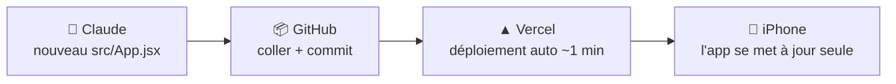

<div align="center">


# COACH MUSCU

**Mon coach de musculation personnel — adaptatif, local, sans compte.**

Force & hypertrophie haut du corps · Recommandations de charge intelligentes · Carnet de progression


</div>

---

Une seule mission : **devenir plus fort et plus musclé**, séance après séance. L'app recommande la charge du jour et explique pourquoi, enregistre chaque série en deux tapotements, détecte les records, la stagnation et la fatigue — et s'adapte. Pas de score opaque : des vrais chiffres (*+5 kg, +3 reps, assistance 20 → 10 kg*).

## ✨ Ce que fait l'app

**🏋️ Le programme (powerbuilding haut du corps, sur machines)** — 4 mouvements lourds : `DÉVELOPPÉ` (Chest Press) · `TIRAGE VERTICAL` (Lat Pull Down) · `ÉPAULES` (Shoulder Press) · `ROWING` (Rameur assis), variante machine d'abord (stable, sans pareur → on peut pousser près de l'échec en sécurité), pilotés au **e1RM et au RPE** : rampes → **top set** → back-offs. Semaine type à 4 jours : `PUSH A · PECS` → `PULL A · DOS LARGEUR` → `PUSH B · ÉPAULES` → `PULL B · DOS ÉPAISSEUR` ; chaque mouvement lourd revient **1× lourd + 1× en volume** par semaine. 2, 3, 5 ou 6 jours : split adapté automatiquement. Jambes : aucune (défaut), entretien (presse + leg curl) ou complet.

**🔗 L'enchaînement** — chaque séance suit le même ordre vérifié : mouvement lourd → volume de l'autre mouvement lourd → angle différent (incliné, dips, rowing appuyé…) → isolations en alternance → abdos. Cinq règles sont contrôlées et affichées dans *Mon programme* : le plus lourd en premier, **aucune pré-fatigue** (pas d'isolation avant un composé du même muscle), jamais deux isolations du même muscle d'affilée, au moins un exercice en **position étirée**, abdos à la fin.

**📌 Programme stable par bloc** — les exercices restent fixes pendant tout le bloc pour que chaque kilo gagné soit mesurable. Au bloc suivant, **ceux qui stagnent sont remplacés, ceux qui progressent restent** (journal des changements affiché). Cadenas pour garder un exercice, bouton « varier les accessoires ».

**🧠 Le coach qui impose plus lourd** — chaque charge est prescrite et expliquée en une phrase, **calée sur les crans réels de ta machine** (tu vois 41, pas 40,5 ; plaque d'appoint 2,25 kg réglable). Pendant la séance, il ajuste en direct et **t'impose plus lourd dès qu'il sent de la marge** : 2ᵉ top set, back-offs remontés, +1 cran sur les séries restantes. Check-in de 15 s → séance ajustée, jusqu'à la séance technique les très mauvais jours, ou « jour fort » où il te pousse.

**📈 La progression** — courbes e1RM, **objectifs de force personnels** (+25 % depuis ton départ, projection « ~N semaines » — les machines n'ont pas de standards universels), force totale des 4 mains, volume hebdo réel vs cible par muscle, suivi du corps avec phase **Recompo** (léger déficit, protéines hautes : plus défini *et* plus fort), records automatiques.

**⚡ En séance** — écran guidé : muscle travaillé partout, message en direct quand le coach change une charge, supersets antagonistes quand le temps est court, timer automatique, remplacement d'exercice classé par pertinence.

## 🧮 Comment le coach décide

| Situation | Décision |
|---|---|
| Mouvement lourd, semaine N du bloc | **Top set** = e1RM × %(reps, RPE cible) posé sur le cran réel de la machine, reps ajustées pour rester pile au RPE ; back-offs 85-90 % |
| RPE cible (machines) | Hyper 7,5 → 9 · Force 8 → 9,5, monte chaque semaine jusqu'au deload |
| Top set facile (≤ RPE cible −1) | **2ᵉ top set imposé** au cran du dessus + back-offs remontés |
| Top set facile, séance suivante | **Élan** : RPE visé +0,5, le cran du dessus est pris dès qu'il est faisable |
| Top set plus dur (≥ +1 RPE) / raté | Back-offs **−5 %** et une série en moins / **−10 %** |
| Back-off facile (RIR ≥ 3) | **+1 cran** sur les back-offs suivants |
| Reprise (linéaire) | 3 × 6 + 1 back-off ; 1re série à RPE ≤ 7 → **+1 cran imposé** sur la suite ; séance réussie → +1 cran (**+2** si tout à RPE ≤ 7) ; cran > 7 % de la charge → +1 rep d'abord |
| 2 échecs d'affilée | Linéaire −7,5 % / RPE : e1RM −5 % et reprise à RPE 7 ; bascule en pilotage par blocs quand le linéaire s'essouffle |
| Accessoire : 1re série au-dessus de la plage (ou RIR ≥ 3) | **+1 cran imposé** sur les séries restantes |
| Accessoire : plafond largement dépassé | **+2 crans** d'un coup (via l'e1RM de l'exercice) |
| Accessoire : cran énorme (> 10 % de la charge) | Reps d'abord (plafond +2), puis on saute |
| Accessoire : 2 séances sous le plancher | **−1 cran** (ou + d'assistance aux dips/tractions) |
| Check-in ≥ 4,2/5 | **Jour fort** : RPE +0,5, cran du dessus |
| Check-in < 2,8 / < 2,2 | RPE −1, moins de volume / **séance technique** |
| Exercice qui stagne sur le bloc | **Remplacé** au bloc suivant (même pattern, meilleur score) |
| Séance manquée | Rien n'est sauté : la rotation reprend à la séance suivante |
| Temps court | Supersets antagonistes, puis retrait d'isolations (jamais le lourd) |
| Plus de 3 semaines sans un mouvement | e1RM décoté de **2,5 %/sem** (max −15 %), reprise à RPE 6,5 |
| Douleur ≥ 5/10 sur une zone | Exercices qui la stressent **remplacés** aujourd'hui |

## 📱 Installation sur iPhone (une seule fois)

1. **GitHub** — crée un dépôt privé et téléverse le contenu de ce dossier (`Add file → Upload files`).
2. **Vercel** — [vercel.com](https://vercel.com) → *Add New Project* → importe le dépôt → *Deploy*. Vite est détecté automatiquement, c'est gratuit.
3. **iPhone** — ouvre l'URL Vercel dans **Safari** → Partager → **« Sur l'écran d'accueil »**. Icône, plein écran, fonctionne hors-ligne.

## 🔄 Mises à jour avec Claude



Toute l'application tient dans **un seul fichier : `src/App.jsx`**. Pour une évolution : demander à Claude → remplacer le fichier sur github.com (faisable depuis le téléphone : ouvrir le fichier → ✏️ → coller → *Commit*) → Vercel redéploie, le service worker applique la mise à jour à l'ouverture suivante.

## ☁️ Synchroniser iPhone ↔ artéfact Claude (optionnel)

Les données vivent **en local sur l'appareil**. Pour les partager entre l'app iPhone et l'artéfact dans Claude : `Profil → Données → Cloud personnel · Supabase` des deux côtés, avec la même URL, la même clé *anon* et le même identifiant. Offre gratuite de Supabase largement suffisante.

<details>
<summary><b>SQL à exécuter une fois dans Supabase</b> (SQL Editor → coller → Run)</summary>

```sql
create table coach_muscu (
  id text primary key,
  payload jsonb,
  updated_at timestamptz default now()
);
alter table coach_muscu enable row level security;
create policy "acces_libre" on coach_muscu
  for all using (true) with check (true);
```

> La politique ouvre la table à quiconque possède ta clé anon : base strictement personnelle, garde la clé pour toi.

</details>

## 💾 Données & sécurité

- **Local-first** : localStorage sur l'iPhone, stockage de l'artéfact dans Claude — aucun compte, aucun serveur obligatoire.
- **Copie de secours** automatique toutes les 2 minutes, restaurable en un tap.
- **Export / import JSON** dans `Profil → Données` : la ceinture de sécurité universelle.
- Sauvegarde à chaque modification **et** à la fermeture de l'app ; écran de récupération si aucune sauvegarde n'est trouvée au démarrage.

## 🗂 Structure

```
coach-app/
├── index.html              # meta PWA / iOS
├── vite.config.js          # React + Tailwind 4 + service worker (autoUpdate)
├── public/icons/           # icônes de l'app
└── src/
    ├── App.jsx             # ⭐ toute l'application — le fichier que Claude met à jour
    ├── main.jsx
    └── index.css
```

## 🛠 Dev local

```bash
npm install
npm run dev      # http://localhost:5173
npm run build    # build de production + service worker
```

<div align="center">

*Conçu pour un seul utilisateur : moi.* 🧡

**React · Recharts · Lucide · Tailwind · vite-plugin-pwa — assemblé avec Claude**

</div>
